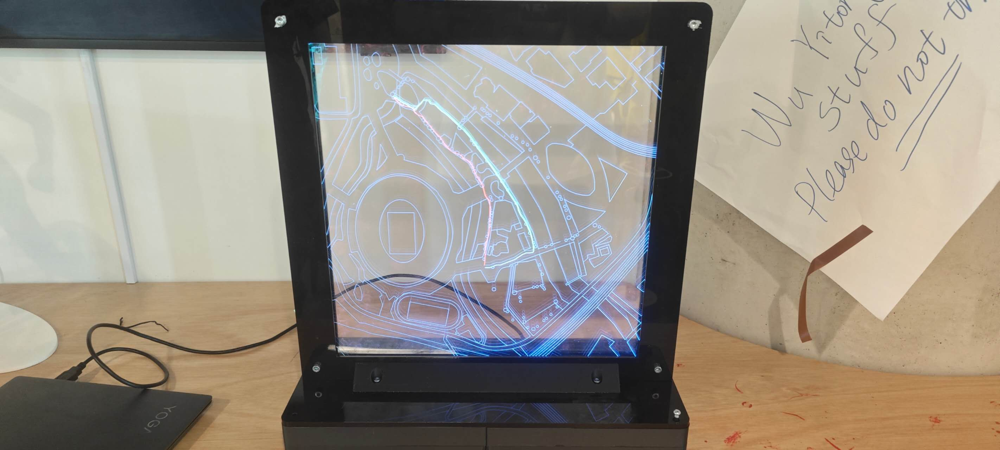
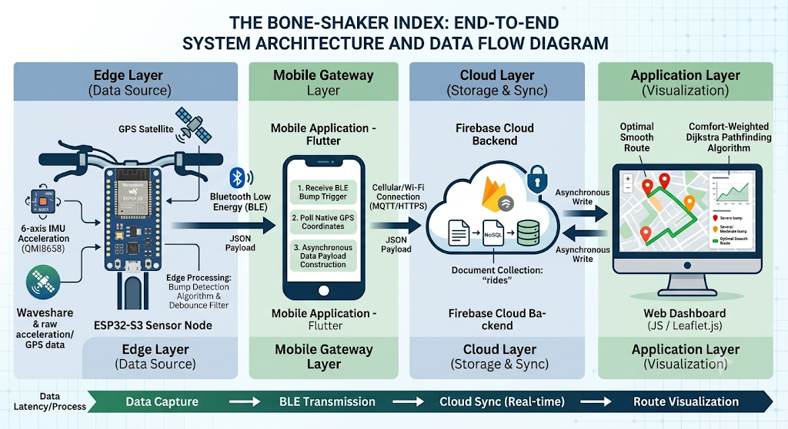
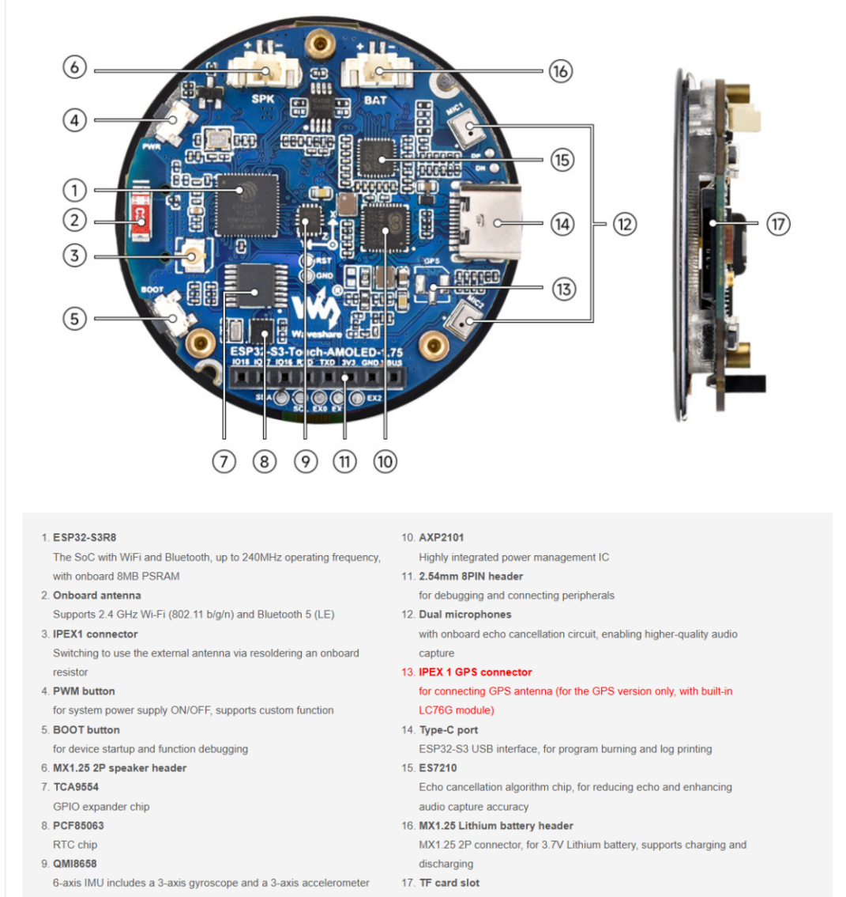
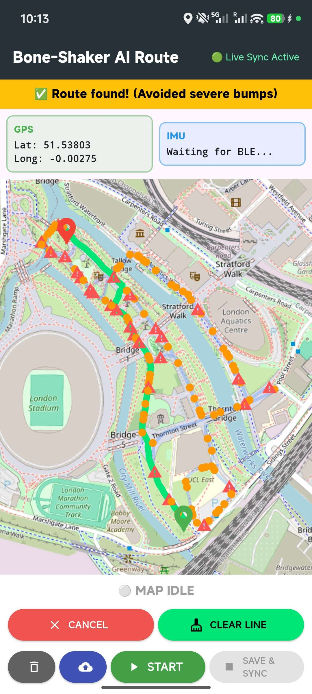

# The Bone-Shaker Index 🚲💥

> **Mapping Road Surface Integrity & Comfort-Optimised Routing for Urban Micro-Mobility**
> 
> *A Master's Dissertation Project for MSc Connected Environments at UCL CASA.*

[](#)
[](#)
[](#)
[](#)



## 📖 Overview

The promotion of active travel relies heavily on the quality and safety of cycling infrastructure. Traditional road surface monitoring methods are vehicle-centric, expensive, and fail to capture the high-frequency vibrations experienced by micro-mobility users. 

**The Bone-Shaker Index** is an open-source, low-cost Internet of Things (IoT) participatory sensing framework. It utilizes a bicycle-mounted edge-computing node to continuously monitor pavement conditions. By categorizing road anomalies and pushing this geospatial data to the cloud, the system empowers cyclists with a **Comfort-Weighted Pathfinding Algorithm** that prioritizes structural safety and ride smoothness over the shortest geographical distance.

## ✨ Key Features

*   **Edge-Processed Anomaly Detection:** Utilizes an ESP32-S3 and QMI8658 IMU to filter rider-induced kinematics (pedaling/steering) and accurately categorize infrastructural degradation (Moderate vs. Severe bumps) locally using a 1500ms debounce filter.
*   **Mobile Gateway Sync:** A Flutter-based mobile application that pairs with the hardware via BLE, appends precise GPS telemetry, and asynchronously syncs payloads to a NoSQL Firebase backend.
*   **Comfort-Weighted Dijkstra Routing:** A custom Leaflet.js web dashboard that mathematically penalizes degraded road nodes, actively routing cyclists around hazardous infrastructure.
*   **Tangible Data Visualisation:** A bespoke 3-tier, laser-cut physical exhibition model internally illuminated by LEDs, translating abstract JSON routing arrays into a compelling boundary object for urban advocacy.

---

## 🏗️ System Architecture



The architecture operates sequentially across three primary nodes:
1.  **Edge Layer:** ESP32-S3 IMU sampling, gravity filtering, and BLE transmission.
2.  **Mobile Gateway:** Flutter app for GPS tagging and cellular cloud uplink.
3.  **Cloud & App Layer:** Firestore database synchronization and Leaflet.js rendering.

---

## 🛠️ Hardware Setup

The physical core is built around the **Waveshare ESP32-S3 Touch AMOLED 1.75**. To ensure the highest fidelity of inertial data, the sensor node is rigidly mounted to the bicycle's central main frame (top tube), effectively isolating steering noise.



**Enclosure Design:**
A custom, weather-resistant enclosure was modeled in Autodesk Fusion and 3D printed. It enforces tight internal tolerances for the ESP32-S3 and Li-Po battery to minimize artificial high-frequency rattling. STL files are available in the `hardware_design/` folder.

---

## 💻 Software & Deployment

### 1. Edge Node Firmware (C++)
*   **Directory:** `/firmware`
*   **Setup:** Built with Arduino IDE / PlatformIO. Ensure the `ESP32` board manager is installed.
*   **Logic:** Samples Z-axis variance. `|ΔZ| >= 0.45G` (Moderate), `|ΔZ| >= 0.65G` (Severe).

### 2. Mobile Gateway (Flutter)
*   **Directory:** `/mobile_app`
*   **Setup:** Run `flutter pub get` to install BLE and Firebase dependencies.
*   **Function:** Background BLE scanning, GPS polling, and real-time UI feedback (Live Sync Active).

### 3. Web Dashboard (JavaScript / Leaflet.js)
*   **Directory:** `/web_dashboard`
*   **Setup:** A static web app. Configure your `firebaseConfig` object in `index.js`.
*   **Algorithm:** Implements coordinate-snapping (11m accuracy) and the custom Comfort-Weighted Dijkstra Algorithm.

 

---

## 📂 Repository Structure

```text
CASA0022-Bone-shaker-index/
│
├── firmware/                 # C++ source code for ESP32-S3 edge processing
├── mobile_app/               # Flutter mobile application (BLE Gateway & UI)
├── web_dashboard/            # Leaflet.js interactive map and routing engine
├── hardware_design/          # 3D STL files for enclosure & Laser-cut CAD files
├── data_analysis/            # Python scripts / Jupyter notebooks for CSV evaluation
├── docs/                     # Images, diagrams, and dissertation assets
└── README.md
